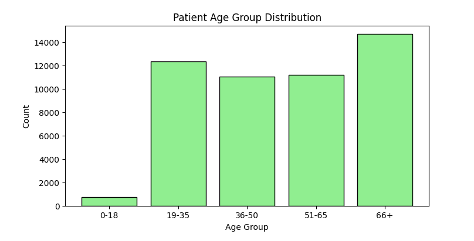

#  Healthcare Data Analysis & Business Insights

 

## Problem Statement
Healthcare organizations often struggle to identify high-risk patients, manage treatment costs, and allocate resources efficiently.  

This project aims to analyze hospital data to uncover **key patterns in patient demographics, medical conditions, and billing behavior**, enabling **data-driven decision-making**.

---

##  Objectives
- Analyze patient data to identify high-risk groups  
- Understand key factors influencing healthcare costs  
- Detect patterns in medical conditions and hospital operations  
- Provide actionable insights for improving efficiency and reducing costs  

---
 

##  Dataset Information
- **Source:** [Kaggle Healthcare Dataset](https://www.kaggle.com/datasets/prasad22/healthcare-dataset)  
- **Records:** 55,500 (before cleaning) → 50,000 (after cleaning)  
- **Features:** 15 columns including:
  - Patient demographics (Age, Gender)  
  - Admission & discharge details  
  - Medical conditions  
  - Billing information  

---

##  Project Workflow
1. **Data Cleaning & Preprocessing**
   - Removed duplicates and inconsistent records  
   - Standardized date formats  
   - Ensured no missing values  

2. **Feature Engineering**
   - Created derived insights from patient data  
   - Grouped age into meaningful segments  

3. **Exploratory Data Analysis (EDA)**
   - Statistical analysis of key variables  
   - Distribution analysis of age and conditions  

4. **Data Visualization**
   - Age distribution analysis  
   - Medical condition frequency  
   - Cost analysis by condition  
   - Correlation heatmap  

---

##  Key Insights

###  Patient Demographics
- Average age: **51.58 years**  
- Age distribution concentrated between **40–70 years**  
- Balanced gender representation  

---

###  Medical Conditions
- Most common conditions: **Cancer, Obesity, Diabetes**  
- Certain conditions are associated with longer hospital stays  

---

###  Billing & Cost Analysis
- Average billing amount: **25,555**  
- Emergency admissions tend to have **higher treatment costs**  

---

###  Correlation Analysis
- No strong linear relationship between variables such as age and billing  
- Indicates healthcare costs may depend on **complex or hidden factors**  

---

##  Business Recommendations

- **Focus preventive care on patients aged 50+**  
  → Early screening can reduce long-term treatment costs  

- **Allocate more resources to high-cost medical conditions**  
  → Improves hospital efficiency and resource planning  

- **Implement early detection programs**  
  → Reduces severity of diseases and improves patient outcomes  

---

##  Project Impact
This project demonstrates the ability to:
- Translate raw healthcare data into meaningful insights  
- Support decision-making through data analysis  
- Identify opportunities for cost optimization and improved patient care  

---

##  Technologies Used
- **Python** – Data analysis  
- **Pandas** – Data manipulation  
- **Matplotlib & Seaborn** – Visualization  
- **Jupyter Notebook** – Interactive analysis  

---

##  Future Enhancements
- Build predictive models for patient risk and cost estimation  
- Develop an interactive dashboard using Streamlit  
- Integrate real-time healthcare datasets  

---
##  Patient Age Group Distribution

This visualization shows that the majority of patients fall in the 66+ age group, followed by middle-aged groups. This indicates higher healthcare demand among older populations.

---
##  Conclusion
This analysis highlights how data can be leveraged to improve healthcare operations, optimize costs, and enhance patient outcomes through informed decision-making.
